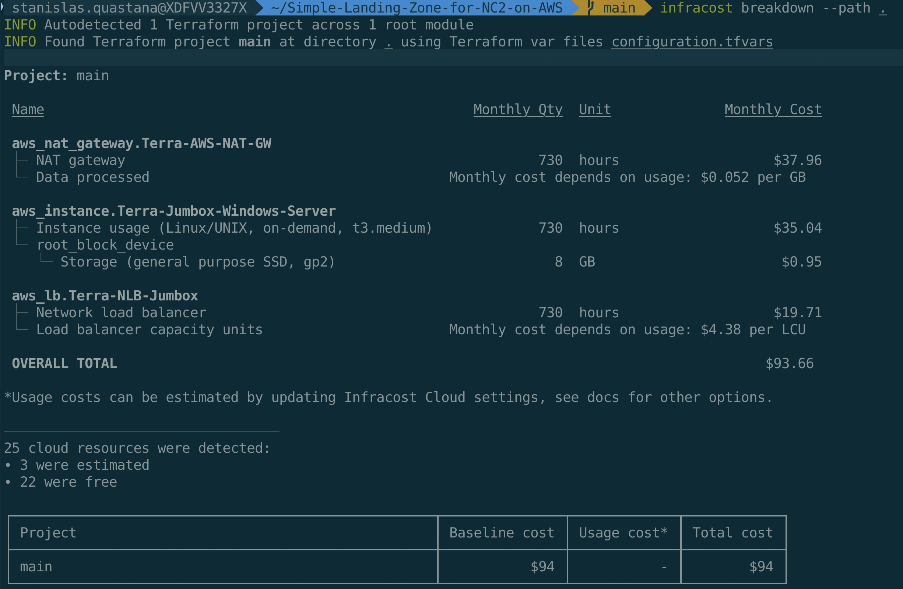

# Simple-Landing-Zone-for-NC2-on-AWS
This repo contains terraform code to deploy a simple network landing zone for Nutanix Cloud Cluster (NC2) on AWS

 


## Prerequisites

- All prerequisites for NC2 : https://portal.nutanix.com/page/documents/details?targetId=Nutanix-Clusters-AWS:aws-clusters-aws-requirements-c.html 
- More information about NC2 on AWS : https://portal.nutanix.com/page/documents/details?targetId=Nutanix-Clusters-AWS:aws-clusters-aws-getting-started-c.html 

- An AWS Account with enough privileges (create Role, ...)
- AWS CLI 2.15 or >: https://docs.aws.amazon.com/cli/latest/userguide/getting-started-install.html or https://github.com/aws/aws-cli/tree/v2  
    - how to configure AWS CLI with your account https://docs.aws.amazon.com/cli/latest/userguide/cli-configure-envvars.html?icmpid=docs_sso_user_portal
- Terraform CLI 1.5 or > : <https://www.terraform.io/downloads.html>
    - Best practices for using the Terraform AWS Provider https://docs.aws.amazon.com/prescriptive-guidance/latest/terraform-aws-provider-best-practices/introduction.html

You can also clone this repo in your AWS Cloud Shell (https://docs.aws.amazon.com/cloudshell/latest/userguide/vm-specs.html) and install terraform in your cloud shell.

For additional information about creating manually your AWS for Nutanix Cloud Cluster : https://portal.nutanix.com/page/documents/details?targetId=Nutanix-Clusters-AWS:aws-aws-create-resources-manual-c.html


## Landing Zone architecture

  

## Step by step operations

Edit [configuration.tfvars](configuration.tfvars) to define your AWS resources names or tags, your AWS region...

You can list your AWS region available using the following command :

```bash
aws ec2 describe-regions --output table
```

The following command gives the region actually used by the CLI regardless of whether environment variables are or are not set:

```bash
aws configure get region

aws ec2 describe-availability-zones --output table --query 'AvailabilityZones[0].[RegionName]'
```

Check that the region and Bare-metal instance you choose are supported for Nutanix Cloud Cluster : https://portal.nutanix.com/page/documents/details?targetId=Nutanix-Clusters-AWS:aws-clusters-aws-xi-supported-regions-metals.html 


If you want to define your own IP ranges, edit [main.tf](main.tf)  (I will change that later to put everything as a variable)

Before deploying check on which AWS Account you are connected :

```bash
aws sts get-caller-identity
```
 

1. Terraform Init phase  

```bash
terraform init
```

2. Terraform Plan phase

```bash
terraform plan --var-file=configuration.tfvars
```

3. Terraform deployment phase (add TF_LOG=info at the beginning of the following command line if you want to see what's happen during deployment)

```bash
terraform apply --var-file=configuration.tfvars
```

4. Wait until the end of deployment (It should take around 2 minutes)

5. Go to Nutanix Cloud Cluster (NC2) Portal https://cloud.nutanix.com and start your Nutanix Cluster deployment wizard.

In Step 1 (**General**) choose the same AWS region and Availability Zone that you used in your terraform deployment

 

In Step 4 (**Network**) choose the VPC and Management Subnets created with terraform


6. After the deployment of the cluster is successfull, you can add connectivity with on-premises or other AWS VPC or services by peering an Transit VPC . If you enabled a bastion and a Jumpbox VM, you can login to the Jumbox VM and connect Prism Element or Prism Central through a web browser.

7. Use the solution and configure Nutanix features like categories, VM, replication...

8. When you want to destroy the Nutanix Cluster, use the NC2 Portal (https://cloud.nutanix.com) to terminate it.

9. After cluster terminaison, you can destroy the landing zone using the following command : 
```bash
terraform destroy --var-file=configuration.tfvars
```


## Check you AWS Console after deployment to see cloud resources created

### Network components

 

 


### S3 buckets for Cluster Protect

 


## How much does it cost to test this landing zone ?

It's very cheap to test and customize this simple landing zone.

You can use **infracost** (available on https://www.infracost.io/) to check the estimate price for 1 month. Here is an exemple for Frankfurt (eu-central-1) AWS Region

 

 :exclamation: Important : this landing zone cost estimation does not include the cost of AWS EC2 Metal instance(s) used as node(s) in the Nutanix Cluster. 
 Please have a look of metal instances prices here : https://aws.amazon.com/ec2/pricing/on-demand/. Pricing is per instance-hour consumed for each instance, from the time an instance is launched until it is terminated or stopped. Each partial instance-hour consumed will be billed per-second for Linux, Windows, Windows with SQL Enterprise, Windows with SQL Standard, and Windows with SQL Web Instances, and as a full hour for all other instance types.


